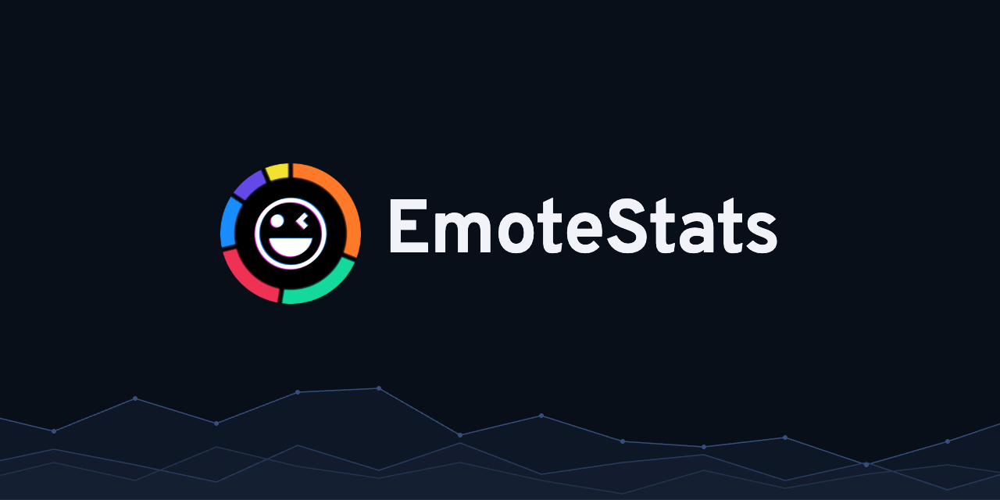
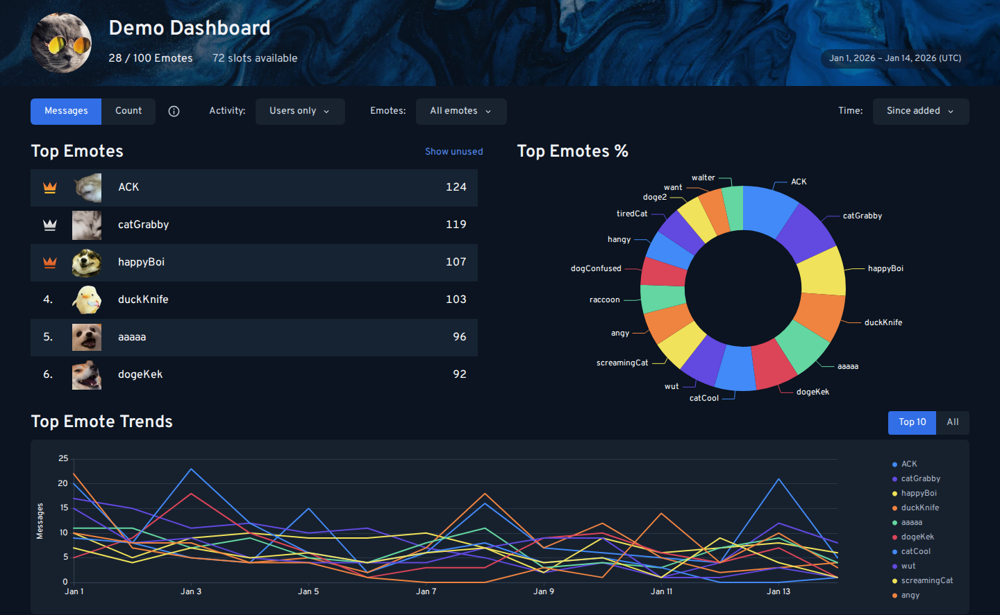
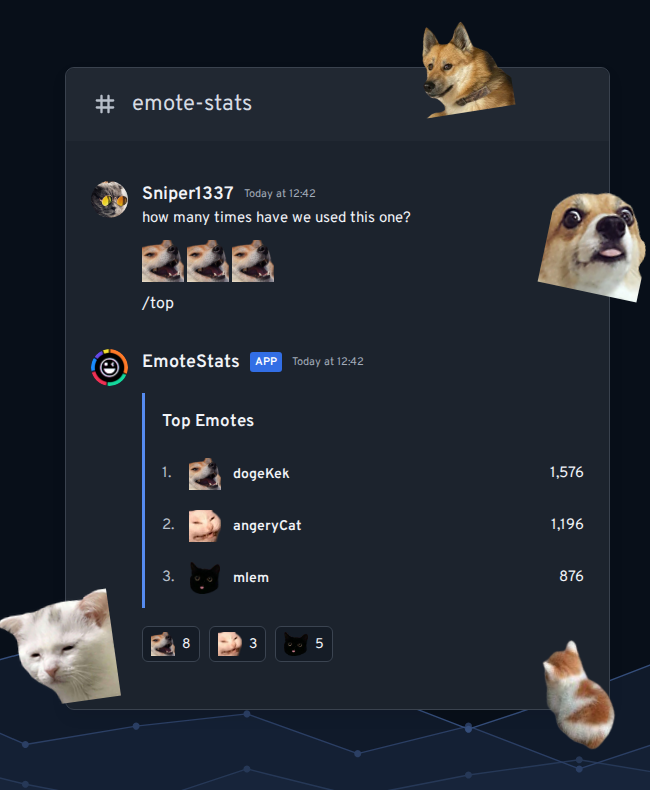

**[Add to Discord] &nbsp;&nbsp;&bull;&nbsp;&nbsp; [Demo] &nbsp;&nbsp;&bull;&nbsp;&nbsp; [Commands]
&nbsp;&nbsp;&bull;&nbsp;&nbsp; [Roadmap] &nbsp;&nbsp;&bull;&nbsp;&nbsp; [Support Server]**

[Add to Discord]: https://discord.com/oauth2/authorize?client_id=701648502404677662&scope=bot
[Demo]: https://emotestats.gg/demo
[Commands]: https://emotestats.gg/commands
[Roadmap]: https://emotestats.gg/roadmap
[Support Server]: https://discord.gg/sVhVtWx
[Privacy Policy]: https://emotestats.gg/privacy-policy
[Terms of Service]: https://emotestats.gg/terms-of-service

EmoteStats tracks custom emote usage in your Discord server. See which emotes people use most,
follow their activity over time, and find the ones nobody uses.

Use slash commands for a quick look, or open your server's dashboard for rankings and graphs.

## Dashboard

See your server's top emotes, how much each one gets used, and how their usage changes over time.
Find unused emotes when you need to make room for new ones.

**[Try the demo](https://emotestats.gg/demo)** to explore the dashboard before adding the bot.

## In Discord

- `/top` and `/bottom` rank your most-used and least-used emotes.
- `/graph` shows how your top emotes change over time.
- `/unused` finds emotes with no recorded use in the selected period.
- `/dashboard` gives you your server's dashboard link.

See [Commands](https://emotestats.gg/commands) for the full list, options, and examples.

## Get started

[Add EmoteStats to your server](https://discord.com/oauth2/authorize?client_id=701648502404677662&scope=bot),
then try `/top` or `/dashboard`. Stats build up as
people use your emotes, so there may not be much to show right after you add it.

See [Data and Retention](https://emotestats.gg/data-and-retention) for what EmoteStats counts and
how long your stats are available.

## Support

Need a hand? Want to report a bug? Join the [Support Server](https://discord.gg/sVhVtWx)!

### Frequently Asked Questions

**Q: How do I use EmoteStats commands?**

**A:** Type /help in your server to see commands, or /ping to check whether EmoteStats responds.
Select EmoteStats from Discord’s command menu.

**Q: Why do Messages and Count show different totals?**

**A:** Messages counts a message once for each custom emoji it contains. Count includes every
appearance of that emoji: three copies in one message add 1 to Messages and 3 to Count. Human
activity is included by default; the Activity menu can include bot and integration activity.

**Q: Why might activity be missing?**

**A:** Coverage can be incomplete when Discord is unavailable, permissions limit what EmoteStats
receives, or the service has an outage. Check your Activity filters and whether the bot can access
the affected channel.

**Q: How much history can I see, and is my dashboard private?**

**A:** Public dashboards show at most 90 days of analytics history and are accessible through their
public links. Analytics do not store raw message content.

---

**[Privacy Policy] &nbsp;&nbsp;&bull;&nbsp;&nbsp; [Terms of Service]**

